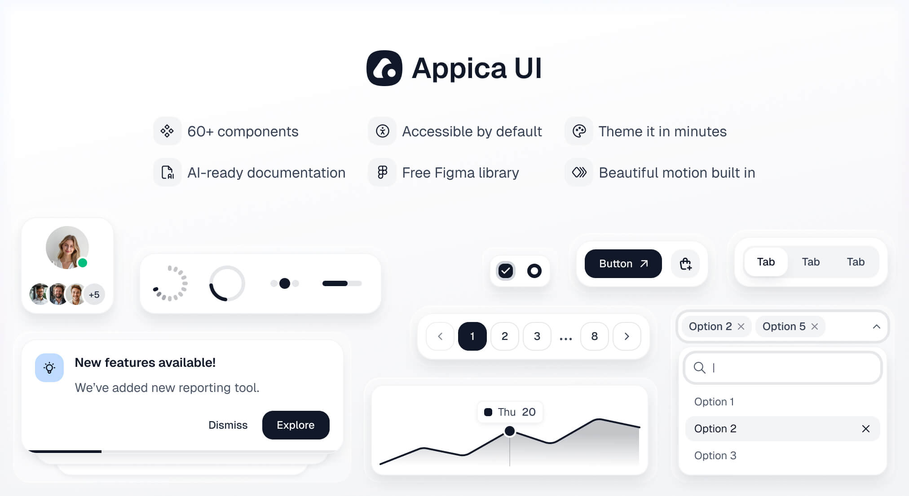

Beautiful, accessible UI designed by humans for the modern web — 60+ themeable components for AI-powered apps, SaaS dashboards, e-commerce sites, and scalable design systems. Polished interactions, dark mode, and full theming out of the box.

This monorepo contains framework-specific packages living under `packages/`. Each package is published to npm independently.

## Packages

|                                                               | Package            | Version                                                                                                 | Links                                                                            |
| ------------------------------------------------------------- | ------------------ | ------------------------------------------------------------------------------------------------------- | -------------------------------------------------------------------------------- |
|  | `@appica/ui-react` |  | [Docs](https://appica.dev/ui/docs/react/installation) · [Source](packages/react) |

More variants are planned — vanilla HTML, Vue and more.

## Documentation

Full documentation, component demos, and theming guides live at [appica.dev/ui](https://appica.dev/ui).

## Figma design file

Every component is also available as a [free Figma design file](https://www.figma.com/community/file/1657080448204231925) — variants, sizes, and states mirrored one-to-one with the code, built on the same design tokens. Design and develop from a single source of truth.

## Stay updated

Follow [@Appica_dev](https://x.com/Appica_dev) on X for release announcements, new components, and previews of what's coming.

## Contributing

See [CONTRIBUTING.md](CONTRIBUTING.md) for development setup and workflow.

## License

MIT © [Appica](https://appica.dev)

Free to use in personal and commercial projects.
